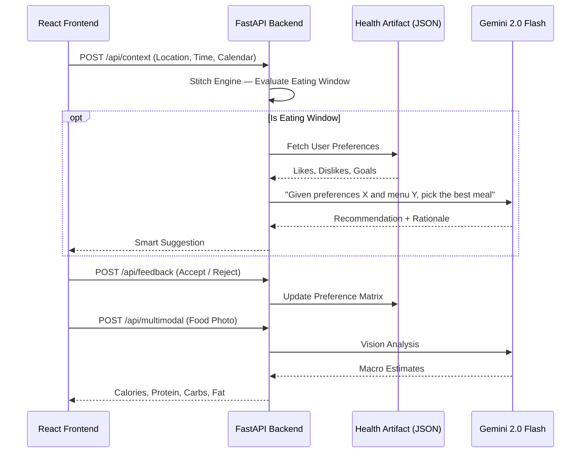

<p align="center">
  
  
  
  
  
  
</p>

# 🥗 NutriFloat — Contextual Nutrition Agent

> A smart, agentic web application that **pre-emptively suggests healthy meals** based on your schedule, location, and nutritional preferences — powered by Google Gemini.

NutriFloat acts as a proactive nutrition assistant. It analyzes simulated Google Calendar and Maps data to detect "eating windows," then queries Gemini 2.0 Flash to recommend the best menu item at your current location — while remembering your preferences across sessions.

---

## ✨ Features

| Feature | Description |
|---|---|
| **Proactive Nudge Engine** | Detects eating windows from calendar + location context and triggers recommendations automatically |
| **Gemini-Powered Suggestions** | Uses Gemini 2.0 Flash to analyze restaurant menus against your health profile |
| **Nutri-Scan Camera** | Snap a photo of any food — the multimodal API estimates calories, protein, carbs, and fat |
| **Behavioral Feedback Loop** | Thumbs up/down feedback refines future suggestions via persistent Health Artifact |
| **End-of-Day Summary** | Gemini generates a comprehensive daily nutrition report |
| **Antigravity UI** | Obsidian-dark, monospace-precise design with Framer Motion micro-animations |

---

## 🏗️ Architecture



---

## 📁 Project Structure

```text
NutriPath/
├── backend/
│   ├── main.py              # FastAPI server — 5 API endpoints
│   ├── test_main.py          # Pytest test suite (5 tests)
│   ├── requirements.txt      # Python dependencies
│   ├── Dockerfile            # Production container (non-root, PORT env)
│   ├── .dockerignore         # Docker build exclusions
│   ├── .env.example          # Environment variable template
│   └── .env                  # Local secrets (git-ignored)
├── frontend/
│   ├── src/
│   │   ├── App.jsx           # Full UI — Dashboard, Nutri-Scan, routing
│   │   ├── HealthContext.jsx  # Global state + API integration layer
│   │   ├── main.jsx          # React entry point
│   │   └── index.css         # Design tokens + utility classes
│   ├── index.html            # HTML shell with SEO meta tags
│   ├── Dockerfile            # Multi-stage build (Node → Nginx)
│   ├── nginx.conf            # SPA routing + gzip + security headers
│   ├── .dockerignore         # Docker build exclusions
│   ├── tailwind.config.js    # Antigravity design system tokens
│   └── package.json          # Node dependencies
├── docker-compose.yml        # One-command local dev + production orchestration
├── cloudbuild.yaml           # GCP Cloud Build CI/CD (backend + frontend)
├── LICENSE                   # MIT
├── .gitignore
└── README.md
```

---

## 🚀 Quick Start

### Prerequisites

- **Node.js** 18+ and **npm**
- **Python** 3.10+
- (Optional) **Docker** & **Docker Compose**

### 1. Clone

```bash
git clone https://github.com/guruprasadsa/Nutripath.git
cd Nutripath
```

### 2. Backend

```bash
cd backend
cp .env.example .env          # Edit with your Gemini API key (or leave as "mock")
pip install -r requirements.txt
python main.py                # Starts on :8080
```

### 3. Frontend

```bash
cd frontend
npm install
npm run dev                   # Starts on :5173, proxies /api to :8080
```

Open **http://localhost:5173** in your browser.

### 4. Docker (Recommended)

```bash
docker compose up --build
```

- Backend → **http://localhost:8080**
- Frontend → **http://localhost:8081**

---

## 🔌 API Endpoints

| Method | Endpoint | Description |
|---|---|---|
| `GET` | `/` | Health check — returns API mode (LIVE / DEMO) |
| `POST` | `/api/context` | Stitch Engine — analyzes context and returns meal recommendation |
| `POST` | `/api/feedback` | Accepts/rejects a suggestion, updates Health Artifact |
| `POST` | `/api/multimodal` | Uploads a food photo for vision-based macro estimation |
| `GET` | `/api/summary` | End-of-day nutrition summary via Gemini |

---

## 🧪 Running Tests

```bash
cd backend
pip install pytest httpx
pytest test_main.py -v
```

---

## ☁️ Deploying to Cloud Run

### One-command deploy

```bash
gcloud builds submit --config cloudbuild.yaml \
  --substitutions=_GEMINI_API_KEY=YOUR_KEY,_BACKEND_URL=https://nutripath-backend-HASH.run.app,_FRONTEND_URL=https://nutripath-frontend-HASH.run.app
```

### Step-by-step

1. **Set your GCP project:**
   ```bash
   gcloud config set project YOUR_PROJECT_ID
   ```

2. **First deploy (get service URLs):**
   ```bash
   gcloud builds submit --config cloudbuild.yaml
   ```

3. **Re-deploy with correct URLs** (after noting the Cloud Run URLs):
   ```bash
   gcloud builds submit --config cloudbuild.yaml \
     --substitutions=_GEMINI_API_KEY=your-key,_BACKEND_URL=https://nutripath-backend-xxx.run.app,_FRONTEND_URL=https://nutripath-frontend-xxx.run.app
   ```

### Environment Variables

| Variable | Where | Description |
|---|---|---|
| `GEMINI_API_KEY` | Backend | Google AI Studio API key. Set to `mock` for demo mode |
| `ALLOWED_ORIGINS` | Backend | Comma-separated frontend origins for CORS |
| `PORT` | Both | Auto-injected by Cloud Run (default: 8080) |
| `VITE_API_URL` | Frontend (build-time) | Backend API URL baked into the SPA at build |

---

## 🎨 Design System

NutriFloat uses the **Antigravity** design language:

| Token | Value | Usage |
|---|---|---|
| `--bg-base` | `#0A0A0D` | Root background |
| `--accent-jade` | `#2EFF9A` | Primary accent — positive states |
| `--accent-mauve` | `#C4A8FF` | Secondary accent — rejected states |
| Font: Display | `Instrument Serif` | Headlines, large numbers |
| Font: Mono | `DM Mono` | Labels, data, chips |
| Font: Sans | `Figtree` | Body text |

---

## 📄 License

MIT — see [LICENSE](./LICENSE).
